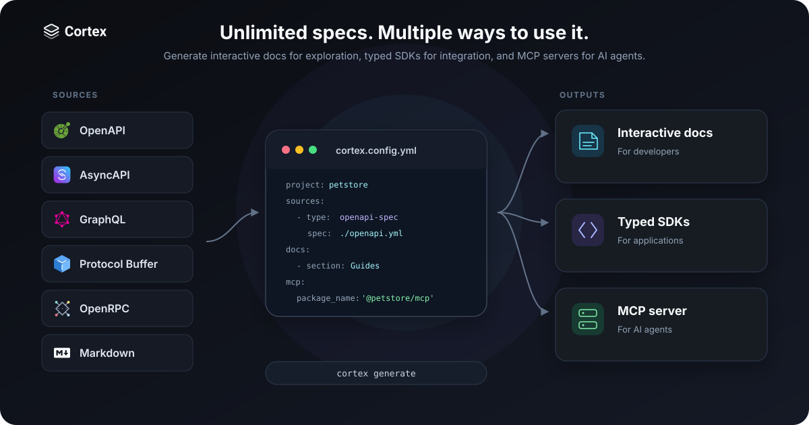

<p align="center">
  <picture>
    <source media="(prefers-color-scheme: dark)" srcset="packages/docs-site/assets/logo_dark.svg">
    <source media="(prefers-color-scheme: light)" srcset="packages/docs-site/assets/logo_light.svg">
    
  </picture>
</p>

<h3 align="center">Every developer. Every agent.</h3>

<p align="center">
  Cortex turns API specifications and Markdown into typed SDKs, interactive documentation, and an MCP server from one project configuration.
</p>

<p align="center">
  OpenAPI · AsyncAPI · GraphQL · gRPC · OpenRPC · Markdown
</p>

<p align="center">
  <a href="https://github.com/cortex-docs/cortex/actions/workflows/ci.yml"></a>
  <a href="https://www.npmjs.com/package/@cortex-docs/cli"></a>
  <a href="LICENSE"></a>
  <a href="https://github.com/cortex-docs/cortex/stargazers"></a>
</p>

<p align="center">
  <a href="https://docs.cortexdocs.dev"><strong>Documentation</strong></a> ·
  <a href="https://demo.cortexdocs.dev"><strong>Live demo</strong></a> ·
  <a href="https://cortexdocs.dev"><strong>Website</strong></a>
</p>



Cortex combines OpenAPI, AsyncAPI, GraphQL, Protocol Buffer, OpenRPC, and Markdown sources. Developers get interactive documentation, applications get typed SDKs, and AI agents get an MCP server with project context.

If Cortex helps your team, [star this repository](https://github.com/cortex-docs/cortex) to support its development.

## Try Cortex in 60 seconds

Create a sample project and inspect the generation plan:

```bash
mkdir petstore
cd petstore
npm install --global @cortex-docs/cli
cortex init petstore
cortex validate
cortex generate --dry-run
```

Cortex validates each source and shows every planned output:

```text
✓ Config is valid
✓ Parsed AsyncAPI: WebSocket API
✓ Parsed GraphQL: GraphQL
✓ Parsed OpenRPC: OpenRPC
✓ Parsed OpenAPI: REST API V1
Languages: typescript, python, go, java, kotlin, ruby, php, csharp, rust, cpp, c

typescript [REST + WS + GraphQL + OpenRPC] → generated/typescript/petstore-typescript-client-sdk
python [REST + WS + GraphQL + OpenRPC] → generated/python/petstore-python-sdk
...
mcp-server → generated/mcp-server
```

The generated MCP server gives AI agents typed tools, specifications, SDK guides, and project documentation.

Generate the files. Then start the documentation server:

```bash
cortex generate
cortex docs serve
```

Open `http://localhost:3012`. Press `Ctrl+C` to stop the server.

## Features

- Generate SDKs for TypeScript, Python, Go, Java, Kotlin, Ruby, PHP, C#, Rust, C++, and C.
- Combine multiple specification files in one generated SDK.
- Generate HTTP, WebSocket, GraphQL, gRPC, and JSON-RPC clients.
- Generate a production documentation server with interactive API reference pages.
- Generate an MCP server with typed tools, embedded specifications, SDK guides, and project documentation for AI agents.
- Add Markdown pages, SDK guides, and all API specifications to the MCP server.
- Customize generated output with sparse Eta template overrides.
- Publish generated packages and MCP servers to language registries and GitHub repositories.

## Unlimited specs. Multiple ways to use it.

Generate interactive docs for exploration, typed SDKs for integration, and MCP servers for AI agents.

| Task                | Split toolchain                                     | Cortex Docs                                                                     |
| ------------------- | --------------------------------------------------- | ------------------------------------------------------------------------------- |
| Configuration       | Configure SDK, documentation, and MCP generators    | Declare all API sources in one project configuration                            |
| Generation          | Coordinate separate commands and output directories | Generate all configured outputs with one command                                |
| Customization       | Maintain templates for each generator               | Override only the required Eta templates                                        |
| Publishing          | Maintain a release process for each package         | Review one publish plan for registries and GitHub                               |
| Developer interface | Keep guides separate from API references            | Combine Markdown, API references, and SDK guides                                |
| Agent interface     | Maintain MCP servers and context separately         | Generate MCP servers with specifications, SDK guides, and project documentation |

## Requirements

- Node.js 20 or later
- npm 10 or later

Some generated SDKs require the normal compiler or package manager for their target language.

## Configuration

`cortex init` creates `cortex.config.yml`. Relative paths start from the directory that contains this file.

```yaml
project: my-api
title: My API Docs
logo: ./assets/logo.svg
theme: system
custom_head_html: |-
  <meta name="theme-color" content="#ffffff">
  <link rel="stylesheet" href="/assets/custom.css">

sources:
  - title: REST API
    type: openapi-spec
    spec: ./specs/openapi.yaml
    intro: ./docs/rest.md
    languages:
      - language: typescript
        package_name: '@my-org/my-api'
      - language: python
        package_name: my-api

  - title: Realtime API
    type: asyncapi-spec
    spec: ./specs/asyncapi.yaml
    languages:
      - language: typescript
        package_name: '@my-org/my-api'

  - title: GraphQL API
    type: graphql-spec
    spec: ./specs/schema.graphql
    endpoint: https://api.example.com/graphql
    languages:
      - language: typescript
        package_name: '@my-org/my-api'

output:
  base_dir: ./generated

docs:
  - section: Get started
    sources:
      - title: Quickstart
        document: ./docs/quickstart.md

mcp:
  package_name: '@my-org/my-api-mcp'
```

`custom_head_html` adds trusted HTML to every documentation page. This field supports metadata, stylesheets, and analytics scripts.

Store local head resources in the project `assets` directory. Cortex serves these files from `/assets/*`.

Cortex does not sanitize this value. Add only HTML that you trust.

Add `?appearance=dark` or `?appearance=light` to any documentation URL to select its initial appearance. The parameter takes priority over the project theme and the visitor's stored preference.

For example, `/docs/quickstart?appearance=dark` opens the quickstart in dark mode. The theme button can change the appearance after the page loads.

Sources that use the same language and `package_name` are merged into one SDK. Cortex rejects duplicate operation and type names that would make a merge ambiguous.

See the [configuration reference](packages/docs-site/docs/configuration.md) for all fields.

## Commands

| Command                                   | Result                                                |
| ----------------------------------------- | ----------------------------------------------------- |
| `cortex init <name>`                      | Create a project and sample files.                    |
| `cortex validate`                         | Validate the config and every API source.             |
| `cortex generate`                         | Generate configured SDKs and the MCP server.          |
| `cortex generate --language typescript`   | Generate one configured language.                     |
| `cortex generate --dry-run`               | Show planned output without writing files.            |
| `cortex docs serve`                       | Start the development server and watch project files. |
| `cortex docs build --output .cortex/docs` | Create a production Node.js documentation build.      |
| `cortex docs start --output .cortex/docs` | Start a production documentation build.               |
| `cortex mcp generate`                     | Generate only the MCP server.                         |
| `cortex publish --dry-run`                | Check package publication without uploading.          |
| `cortex publish`                          | Publish enabled generated packages.                   |

## Protocol support

| Source          | Generated SDK                             | Documentation                 | Generated MCP server                |
| --------------- | ----------------------------------------- | ----------------------------- | ----------------------------------- |
| OpenAPI         | REST clients                              | Interactive API reference     | Callable tools and embedded specs   |
| AsyncAPI        | WebSocket clients                         | Channel and message reference | Payload-preparation tools and specs |
| GraphQL SDL     | Query, mutation, and subscription clients | Operation and type reference  | Callable tools and embedded schema  |
| Protocol Buffer | Unary and streaming gRPC clients          | Service and message reference | Embedded `.proto` resources         |
| OpenRPC         | JSON-RPC clients                          | Method and schema reference   | Callable tools and embedded specs   |

The generated MCP server does not call gRPC methods. It exposes Protocol Buffer files as MCP resources so an agent can inspect the service contract.

## Production documentation

The build command creates a self-contained Next.js server. It is not a static HTML export.

```bash
cortex docs build --output .cortex/docs
NODE_ENV=production cortex docs start --output .cortex/docs --port 3000
```

Deploy the output directory to a service that can run Node.js. Keep `cortex.config.yml` and its referenced specifications available at runtime.

## MCP output

```bash
cortex mcp generate --output .cortex/mcp-server
cd .cortex/mcp-server
npm install
npm run build
npm start
```

The generated package contains local copies of every configured specification. It also embeds configured Markdown and generated SDK README files as tools.

## Packages

The release workflow publishes `@cortex-docs/cli` and `@cortex-docs/mcp`. The CLI tarball includes the internal runtime workspaces.

| Package                | Distribution    | Purpose                                        |
| ---------------------- | --------------- | ---------------------------------------------- |
| `@cortex-docs/cli`     | npm             | Command-line interface and project workflow    |
| `@cortex-docs/mcp`     | npm             | MCP server for the Cortex documentation        |
| `@cortex-docs/core`    | Included in CLI | Configuration loader and specification parsers |
| `@cortex-docs/codegen` | Included in CLI | SDK generation engine and language templates   |
| `@cortex-docs/mcp-gen` | Included in CLI | MCP server generator                           |
| `@cortex-docs/docs-ui` | Included in CLI | Documentation runtime used by the CLI          |

## Documentation

- [Quickstart](packages/docs-site/docs/quickstart.md)
- [Configuration](packages/docs-site/docs/configuration.md)
- [SDK generation](packages/docs-site/docs/sdk-generation.md)
- [WebSocket SDKs](packages/docs-site/docs/websocket-sdks.md)
- [GraphQL](packages/docs-site/docs/graphql.md)
- [gRPC](packages/docs-site/docs/grpc.md)
- [OpenRPC](packages/docs-site/docs/openrpc.md)
- [MCP servers](packages/docs-site/docs/mcp-servers.md)
- [Publishing](packages/docs-site/docs/publishing.md)

## Contributing and security

Read [CONTRIBUTING.md](CONTRIBUTING.md) and [DEVELOPMENT.md](DEVELOPMENT.md) before you open a pull request.

Report vulnerabilities through the private process in [SECURITY.md](SECURITY.md).

## License

Cortex Docs is available under the [MIT License](LICENSE).

If Cortex saves you time, [give the repository a star](https://github.com/cortex-docs/cortex). It helps more developers find the project.
